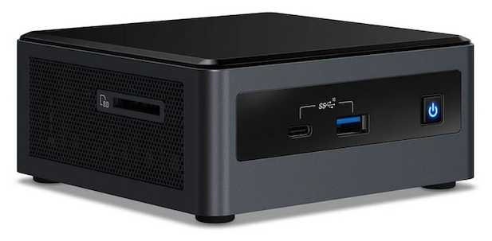

---
hide:
  - footer
---
# Community Lab
Her finner du litt teknisk informasjon om vår Community Lab!

## Hensikt

Hensikten med Community Lab er å gjøre det mye enklere for alle våre konsulenter å ha tilgang til labmiljø for læring, POC og sertifiseringer. I tillegg prøver vi å holde liv i alle labmiljøene vi har satt opp i samarbeid med våre partnere som Fortigate og Aruba.

## Dagens løsning
Vi har vært heldig å fått etablere dagens løsning i Sopra Stera sin TechEdge lab. Dette er en lab som er satt opp og driftes i Sopra Steria sine lokaler. Dette gjør at vi slipper "lokal"-drift hjemme. I TechEdge labben satt opp med Nutanix hypervisorer. Her har vi per nå to VM-er. En for CML-instansen og en linux server (webserver) for blant annet booking og denne wiki siden.

Cloudflare for å håndtere DNS og trafikkstyring og Zero Trust for å beskytte de interne appene slik at bare autoriserte brukere får tilgang.

Vi ønsker å utvide tilbudet og trenger derfor innspill til hvilke tjenester det kan være nyttig å etablere!

## HISTORIKK
Community Lab startet som et prosjekt av tidligere Competancy Lead Christopher W. Tvedt. Den første utgaven av miljøet ble etablert i hans hjemmenett. Løsningen besto av en Intel NUC for å kjøre de forskjellig serverrollene og et sett med FortiGate 40F for VDOM og SD-WAN Lab Spoke.

<figure markdown>
  { width="500" }
  <figcaption>Intel NUC10I7FNHN2</figcaption>
</figure>

|           | Beskrivelse                          |
| --------- | ------------------------------------ |
| CPU	      | 6 kjerner Intel Core i7 10710U       |
| Minne     | 64GB Kingston Fury Impact DDR4       |
| Lagring   | 2TB Kingston NV1 M.2 NVMe SSD        |

Det ble kjørt på ESXi 7.0 på Community Lab NUC