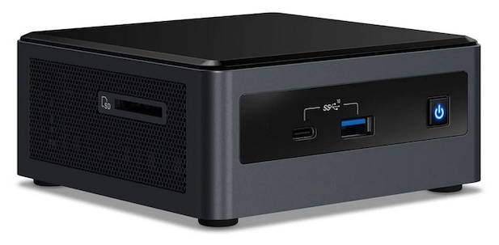

---
hide:
  - footer
---

# Om Community Lab

Community Lab gir nettverkskonsulenter i Sopra Steria tilgang til felles labmiljøer for læring, sertifisering, testing og proof of concept (POC).

## Hvem er tilbudet for?

Tilbudet er laget for konsulenter som ønsker å:

- prøve produkter og teknologier uten å bygge et eget miljø;
- øve til sertifiseringer;
- teste konfigurasjon og design;
- dele laboppgaver og erfaringer med andre;
- videreføre miljøer etablert sammen med teknologipartnere.

Tilgang og kapasitet varierer mellom miljøene. Se den enkelte labsiden før du begynner.

## Dagens løsning

Community Lab er etablert i Sopra Sterias TechEdge-lab og driftes i Sopra Sterias lokaler. Det gjør at sentrale tjenester ikke er avhengige av lokal drift hjemme.

TechEdge-laben bruker Nutanix-hypervisorer. Community Lab har per nå to virtuelle maskiner:

- én VM for Cisco Modeling Labs (CML);
- én Linux-server for blant annet bookingløsningen og denne wikien.

Cloudflare håndterer DNS og trafikkstyring. Cloudflare Zero Trust beskytter interne applikasjoner slik at bare autoriserte brukere får tilgang.

## Forenklet arkitektur

```text
Bruker
  │
  ▼
Cloudflare og Zero Trust
  │
  ├── Wiki og bookingtjeneste
  │
  └── Tilgang til labmiljøer
          │
          └── Cisco Modeling Labs og øvrige tjenester
```

Diagrammet er en forenklet oversikt og inneholder ikke nettverks- eller sikkerhetsdetaljer.

## Tilgang og sikkerhet

- Bruk bare kontoer og tilganger som er tildelt deg.
- Ikke endre delte passord med mindre veiledningen uttrykkelig ber om det.
- Ikke publiser påloggingsinformasjon i wikien, GitHub eller Teams.
- Rydd opp egne tester når laboppgaven er ferdig.
- Meld sikkerhetsproblemer direkte til kontaktpersonene, ikke i en åpen kanal.

## Historikk

Community Lab startet som et prosjekt av tidligere Competency Lead Christopher W. Tvedt. Den første utgaven ble etablert i hjemmenettverket hans. Løsningen besto av en Intel NUC som kjørte de forskjellige serverrollene, og et sett med FortiGate 40F for VDOM- og SD-WAN-lab.

<figure markdown>
  { width="500" }
  <figcaption>Intel NUC10I7FNHN2</figcaption>
</figure>

| Komponent | Beskrivelse |
| --- | --- |
| CPU | 6-kjerners Intel Core i7-10710U |
| Minne | 64 GB Kingston Fury Impact DDR4 |
| Lagring | 2 TB Kingston NV1 M.2 NVMe SSD |
| Plattform | VMware ESXi 7.0 |

Community Lab er senere flyttet fra denne lokale løsningen til TechEdge-laben.
